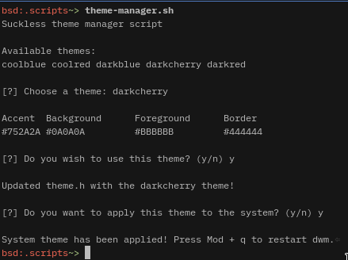
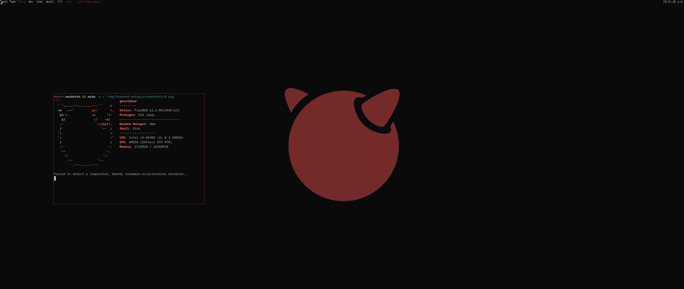
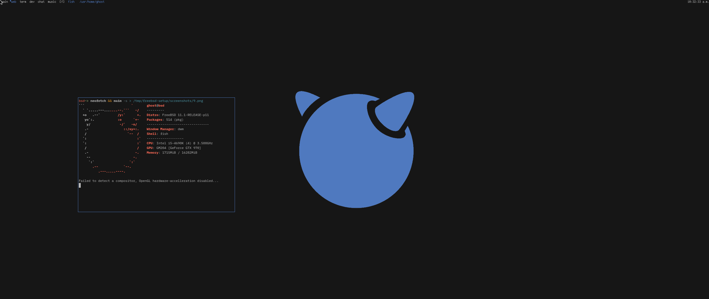
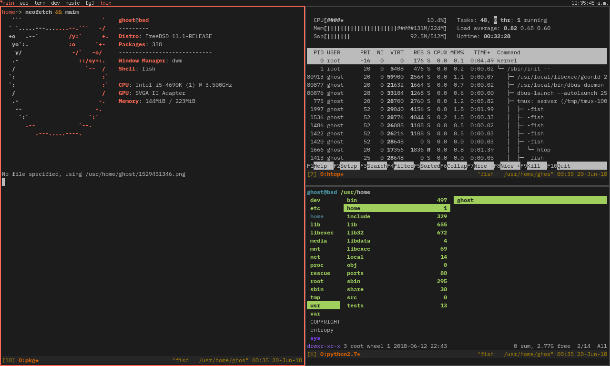
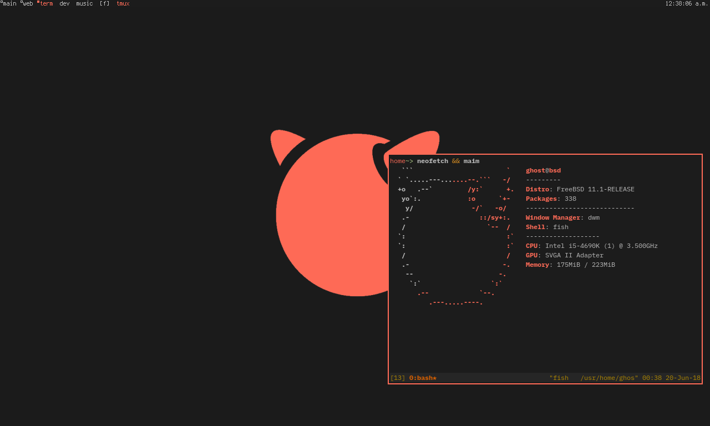
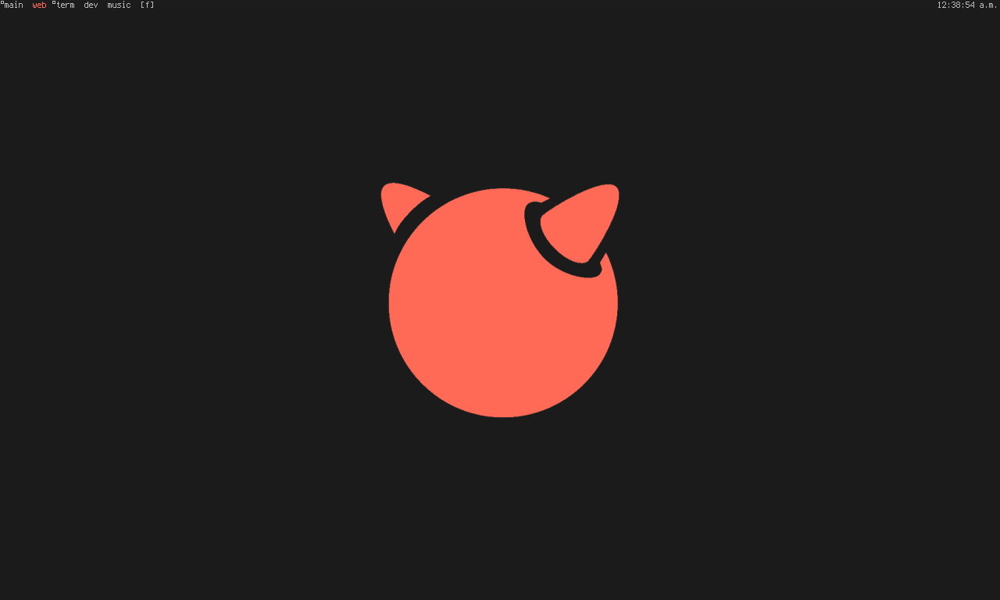
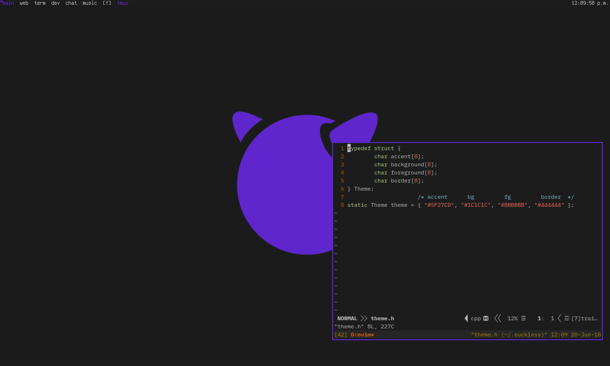
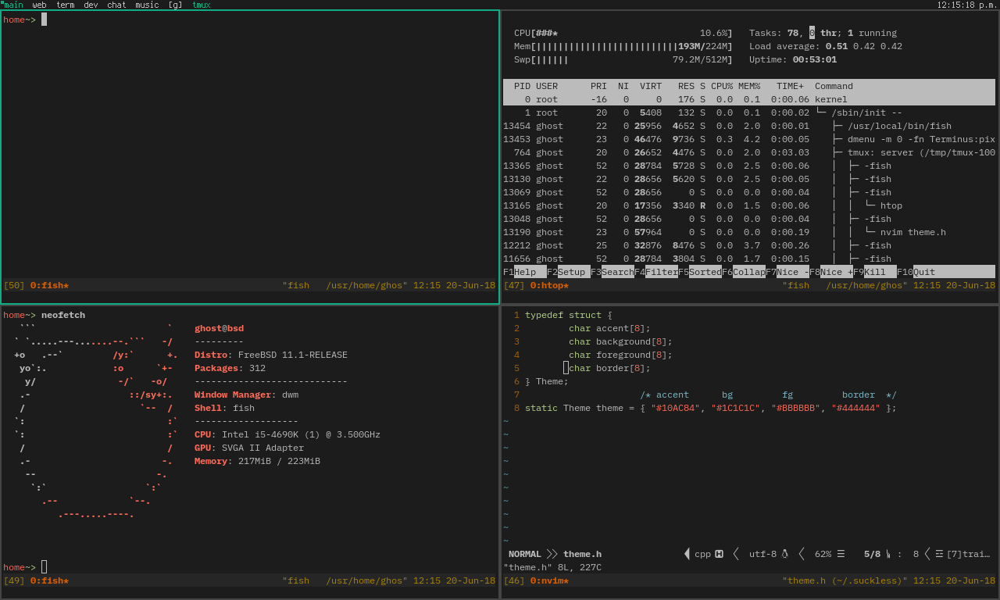
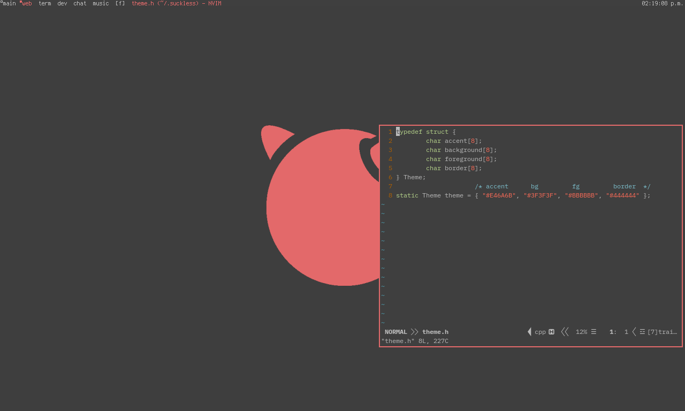

# What is this?
This repository is my current FreeBSD setup as of June 2018, which comes with my custom configuration files. Some of these include the following: 
- **fish**: Custom functions to easily install ports either from source or binary blobs (see ~/.config/fish/functions/ for the available commands);
- **neovim**: Fork of vim that's updated frequently, including useful plugins to make developement easier, keymaps, etc;
- **dwm**: dwm (short for dynamic window manager) is a bare-bones window manager written for X where you patch in the features you want;
- **st**: The suckless terminal. A *very*, if not most minimal terminal that follows the suckless software philosophy;
- **ranger**: Lightweight terminal-based-all-in-one-file-manager you'll ever need;
- There's also configuration files for dmenu, tmux, neofetch, htop, zathura (pdf viewer with vim bindings) and a few others.

**fish port functions**

I've written some very basic fish functions that somewhat act as a wrapper for port. By no means do you have to use these. Took me the space of 20 minutes to write all these and have been helpful, especially if you wish to install a package from source. Here's the full list below:
- **psearch \<package\>**: Search for a package in ports; ``e.g psearch firefox``
- **pinstall \<group/package\> [--source/-s]**: Install a package either from source or binary blob; ``e.g. pinstall www/firefox --source``
- **premove \<group/package\>**: Remove a package that's installed on the system; ``e.g. premove www/firefox``
- **pupdate**: Update the ports collection;
- **pupgrade**: Upgrade FreeBSD, applying any new patches;
- **pstats**: Returns info about the installed packages.

Granted, this work-flow (for me personally) helps me get things done a lot quicker (especially  with my keybindings) - I'm not guaranteeing this is the right setup for you. If you find anything to improve /and/or/ criticize I'm open to suggestions, simply open a PR and I'll take a look into it. For this setup I've made it easier to change the theme. You can apply the theme you want for dwm, st, dmenu and wallpaper by changing the hex values within the ``~/.suckless/theme.h`` header file. The script ``~/.script/theme.sh`` compiles dwm and st, creates a background (``~/.script/.background.png``) that's then applied as the wallpaper. All of the colors are relative to the header file, for example, changing the accent color to white (``#FFF``) will be shown in dwm, st and the wallpaper - it's as simple as that. I've tried to keep this setup of mine as minimalistic and simplistic as I can for ease of use. Once you've changed the accent run the command ``theme.sh`` to apply it, for the theme to take effect on /dwm/st/ press the modkey (Windows key) and q to restart dwm. By default in dwm st is started with a tmux session. If you wish to change that navigate to ``~/.suckless/dwm/config.h`` and remove tmux from the command that starts st.

*Note: All of the key bindings for dwm are in ``~/.suckless/dwm/config.h``.* The modkey is set to the Windows key, a quick overview of the bindings are as following:
- **Mod + Enter**: Open a terminal;
- **Mod + q**: Restart dwm (needed after when ran with ``theme.sh``, note that this will restart the layout to tiling mode);
- **Mod + r**: Start dmenu, program launcher;
- **Mod + t**: Tiling layout mode;
- **Mod + f**: Floating layout mode;
- **Mod + g**: Grid layout mode.

# Prerequisites
There isn't much prerequisites as the setup script makes it *for the most part* autonomous. Before you continue running the setup I assume you're under these following conditions:
- Basic /UNIX/BSD*/ knowledge;
- Freshly installed FreeBSD system;
- Git installed (``pkg install git``);
- Bash installed (``pkg install bash``) - I'd like to make bash redundant but the bourne shell doesn't support arrays ~~damn POSIX~~;
- Doas installed (``pkg install doas``) and the user added to the doas config file with 'nopass' enabled for that user (makes life much easier, run this command on the root account): ``echo "permit nopass YOUR_USER as root" | tee -a /usr/local/etc/doas.conf``;
- I'm aware this isn't a good practice allowing users running doas without a password. Security isn't a number one priority in this type of environment; simply for the sake of convenience.
- Everything else is pulled in by the setup script. Nothing else required - only a brain and common sense.

# Setup
There's not much to it (given you've met the prerequisites). *Now for the fun part*:
- Changing your current directory to ``/tmp`` with of course ``cd /tmp``;
- Cloning this repo ``git clone https://gitlab.com/omnistar/freebsd-setup`` and changing to that given directory ``cd freebsd-setup``;
- From there you'll find a setup script ``setup.sh`` that you can run by typing ``./setup.sh`` and everything else is done for you;
- When changing the default shell ``chsh`` you'll be prompted to enter your password;
- What the script does is check if the required packages are installed, change the default shell to fish and install the IBM Plex Mono fonts. Feel free to check the script.

*As simple as that*. You should be done now, given my mediocre scripting has worked for you. I'd suggest rebooting the system once the setup script has completed.

# Theme manager
I've included a simplistic theme manager script for /dwm/st/etc/ located at ``~/.scripts/theme-manager.sh``. As of now there's a few theme configs (`~/.suckless/themes/`) that you can apply to the system, the script directory is appended to the ``$PATH`` environment variable meaning you can run ``theme-manager.sh`` from anywhere (this also applies to any other script inside ``~/.scripts/``).

**How do I use it?**
Open a terminal and type ``theme-manager.sh``, you'll be prompted with an array of different themes to choose from. Type the theme you wish to apply (case sensitive!) and confirm the change by typing ``y``; else the script will exit. You'll then be given the option to apply the theme to your system oppose to just overwriting the theme header file. If you choose to apply the theme to the whole system you must restart dwm with the keybind ``Mod + q``. Below is a screenshot of it in action:

**How does it work?**
Themes are read from ``~/.suckless/themes/*.conf`` parsing the hex values with awk, then using sed to replace those values inside of ``~/.suckless/themes/theme`` which /dwm/st/ inherits. To add your own theme it's as following:
- Create a new file in ``~/.suckless/themes/`` with the given file extension conf (this is crucial for it the script to detect it!) e.g. ``epictheme.conf``;
- The format of the theme config is ``accent:background:foreground:border``, no more, no less. e.g. ``#752A2A:#1C1C1C:#BBBBBB:#44444``;
- That conf will then be parsed and should be available as a theme to choose from - that's it - you can now use ``epictheme``! *easy-as-pie*.

**Example themes**
- ``darkcherry`` theme:

- ``darkblue`` theme:

# Screenshots
Glorious screenshots of the setup. You're able to make variations of the setup with the header file, customize it to your heart's desire - see the ``Theme manager`` section for more details.

- Default accent ``#FF6B57`` and background ``#1C1C1C``:

- Accent ``#5F27CD``:

- Accent ``#10AC84``:

- Accent ``#E46A6B`` and background ``#3F3F3F``:

